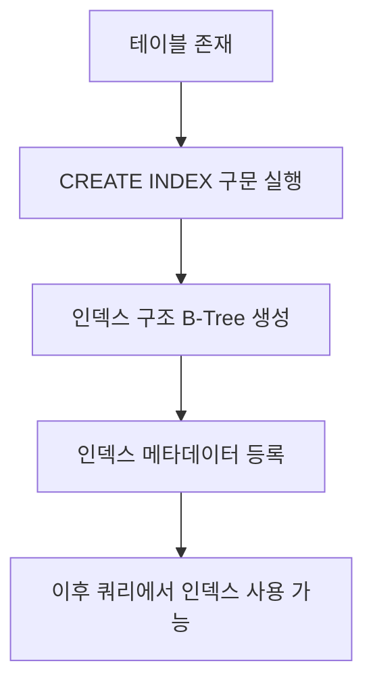
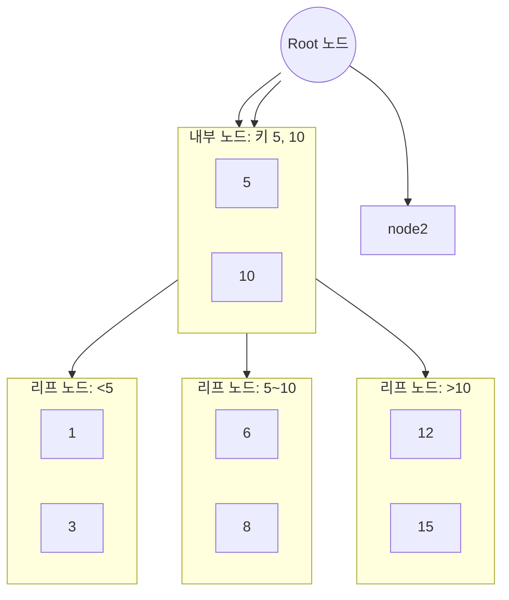
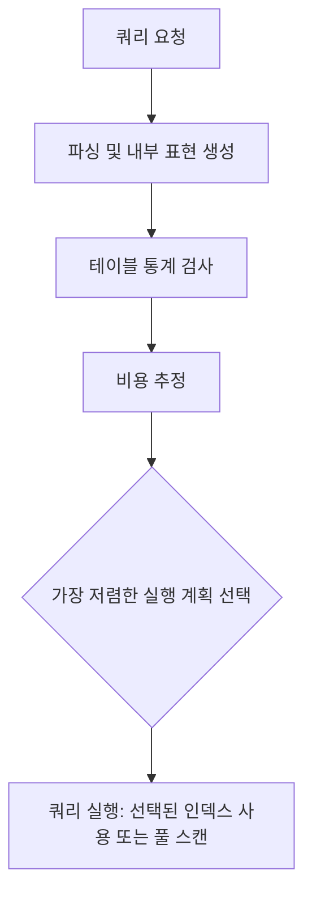

### **1. 데이터베이스 인덱스란?**

데이터베이스 인덱스는 **특정 데이터를 더 빠르게 조회하기 위해 사용되는 특별한 자료구조**가 된다. 마치 책의 목차나 찾아보기와 같다고 이해할 수 있다. 인덱스가 없다면 100만 개의 데이터에서 특정 '민수'라는 이름을 찾을 때, 모든 데이터를 하나하나 다 확인하는 **풀 스캔(Full Scan) 또는 테이블 스캔(Table Scan)을 수행하게 된다**. 이 경우 시간 복잡도는 데이터의 총 개수가 n개일 때 **O(n)이 된다**.

하지만 인덱스가 적용되어 있다면, **O(n)보다 훨씬 빠른 O(log n)의 시간 복잡도로 데이터를 찾을 수 있게 된다**. 이는 주로 B-Tree(비트리) 기반 인덱스에서 나타나는 성능 향상이 된다.

인덱스는 단순히 데이터를 빠르게 조회하는 것을 넘어, **상황에 따라 데이터를 빠르게 정렬(ORDER BY)하거나 그룹화(GROUP BY)하는 데도 사용될 수 있다**. 또한 `UPDATE`나 `DELETE` 문에서 특정 조건을 만족하는 튜플을 찾을 때, 그리고 **테이블 조인(JOIN) 시에도 조건을 빠르게 찾기 위해 핵심적으로 활용된다**.

#### 시각화 예시

##### 1) 풀 스캔 vs 인덱스 조회

- 풀 스캔: 모든 행을 순차적으로 읽어 조건을 확인
- 인덱스 조회: B-Tree 형태로 탐색 → 포인터로 실제 행 접근


##### 2) 시간 복잡도 비교

```
풀 스캔:  O(n)        ███████████████████████████████████████
인덱스 조회: O(log n) ████████
```

(실제 n 값에 따라 차트 길이가 달라지지만, 여기서는 개념적으로 O(n) 대비 O(log n)이 훨씬 짧음을 나타낸다.)

---

### **2. 인덱스 생성 방법**

인덱스는 크게 두 가지 방식으로 생성할 수 있게 된다.

- **이미 생성된 테이블에 인덱스 추가**:

  ```sql
  -- 동명이인 등 중복이 허용되는 '네임' 애트리뷰트에 인덱스 생성
  CREATE INDEX 인덱스이름 ON 테이블이름 (애트리뷰트이름);
  -- 예시: 플레이어 테이블의 네임 애트리뷰트에 인덱스 생성
  CREATE INDEX idx_player_name ON Player (name);
  ```

  ```sql
  -- 유니크한 값을 조회하기 위한 복합 인덱스 (두 개 이상의 애트리뷰트 조합) 생성
  -- 예시: 플레이어 테이블의 팀 ID와 백넘버 조합에 유니크 인덱스 생성 (같은 팀 내 등번호는 유니크)
  CREATE UNIQUE INDEX uidx_player_team_id_back_number ON Player (team_id, back_number);
  ```

  이처럼 두 개 이상의 애트리뷰트로 구성된 인덱스를 **멀티컬럼 인덱스(Multi-column Index)** 또는 **컴파짓 인덱스(Composite Index)** 라고 부르게 된다.

- **테이블 생성 시 함께 인덱스 정의**:

  ```sql
  CREATE TABLE Player (
      id INT PRIMARY KEY, -- Primary Key는 대부분의 RDBMS에서 자동으로 인덱스 생성됨
      name VARCHAR(255),
      team_id INT,
      back_number INT,
      INDEX idx_name (name), -- 인덱스 이름 생략 가능
      UNIQUE INDEX uidx_team_id_back_number (team_id, back_number) -- 인덱스 이름 생략 가능
  );
  ```

  **대부분의 RDBMS는 기본 키(Primary Key)를 생성할 때 자동으로 해당 키에 대한 인덱스를 함께 생성해 주게 된다**. 하지만 외래 키(Foreign Key)의 경우 RDBMS에 따라 인덱스가 자동으로 생성되지 않을 수도 있으므로, 조인 성능을 위해 필요하다면 별도로 인덱스를 고려하는 것이 좋게 된다.

#### 시각화 예시

##### 1) 인덱스 생성 흐름 다이어그램



##### 2) 멀티컬럼 인덱스 순서 중요성 시각화 (간단한 정렬 예시)

- 테이블에 값:

  | A   | B   | 기타 컬럼 |
  | --- | --- | --------- |
  | 7   | 95  | ...       |
  | 7   | 10  | ...       |
  | 3   | 50  | ...       |
  | 7   | 20  | ...       |
  | 3   | 10  | ...       |

- `(A, B)` 멀티컬럼 인덱스 생성 시 정렬 순서:

  | A   | B   |
  | --- | --- |
  | 3   | 10  |
  | 3   | 50  |
  | 7   | 10  |
  | 7   | 20  |
  | 7   | 95  |

- 이 순서대로 B-Tree 노드에 저장됨.
- WHERE A = 7 AND B = 20 처럼 A,B 모두 사용 시 빠르게 탐색 가능.
- WHERE B = 50 처럼 B만 사용 시 이 정렬 순서로는 탐색 불가능.

---

### **3. B-Tree 기반 인덱스의 동작 방식**

대부분의 데이터베이스 인덱스는 **B-Tree(비트리)라는 자료구조를 기반으로 동작하게 된다**. B-Tree 인덱스는 다음과 같은 특징을 갖게 된다.

- **정렬된 데이터**: 인덱스는 해당 애트리뷰트의 값들을 **항상 정렬된 형태로 저장한다**.
- **포인터**: 각 인덱스 데이터는 실제 테이블의 튜플(행)을 가리키는 **포인터 정보도 함께 가지고 있게 된다**.

**데이터 조회 과정 예시:**

1. **단일 컬럼 인덱스를 사용한 조회**:
   예를 들어 `A` 애트리뷰트에 인덱스가 있고, `A = 9`인 튜플을 찾는다고 가정하자.

   - 인덱스는 `A` 값들이 정렬되어 있으므로, 처음부터 순차적으로 찾는 대신 **이진 탐색(Binary Search) 방식으로 빠르게 원하는 값을 찾게 된다**.
   - 값을 찾으면 해당 포인터를 통해 실제 테이블의 튜플에 접근하게 된다.

2. **멀티컬럼 인덱스의 동작 및 순서의 중요성**:
   `A, B` 두 애트리뷰트로 구성된 멀티컬럼 인덱스를 만들었다고 가정하자.

   - 이 인덱스는 **인덱스 생성 시 지정된 애트리뷰트 순서(예: A, B)에 따라 정렬된다**. 즉, 1차적으로 `A`를 기준으로 정렬되고, `A` 값이 같은 경우에만 2차적으로 `B`를 기준으로 정렬되는 방식이 된다.
   - **이 순서는 매우 중요하게 된다.** 만약 `WHERE A = 7 AND B = 95`와 같은 조건으로 조회한다면, `A`와 `B` 모두 인덱스를 통해 빠르게 찾을 수 있게 된다.
   - 하지만 만약 `WHERE B = 95`처럼 **인덱스 정의 시 두 번째 애트리뷰트(B)만으로 조회한다면, 이 인덱스는 제대로 활용되지 못하고 성능이 좋지 않게 된다**. 왜냐하면 인덱스 상에서 `B`만 놓고 봤을 때는 정렬되어 있지 않기 때문에 이진 탐색을 할 수 없게 된다. 이 경우 풀 스캔과 크게 다르지 않거나 오히려 더 느려질 수도 있게 된다. 따라서 `B`만으로 조회가 잦다면 `B`에 대한 별도의 인덱스를 생성해야 하는 상황이 발생할 수 있게 된다.

3. **단일 컬럼 인덱스에서 복합 조건 조회 시의 비효율**:
   `A`에만 인덱스가 있는 상황에서 `WHERE A = 7 AND B = 95`와 같은 조건으로 조회하는 경우를 생각해 보자.

   - `A = 7` 조건은 인덱스를 통해 빠르게 찾을 수 있게 된다.
   - 그러나 `B = 95` 조건은 인덱스에 포함되어 있지 않으므로, `A = 7`을 만족하는 **모든 튜플에 대해 실제 테이블로 이동하여 `B` 값을 하나하나 비교해야 하는 비효율이 발생하게 된다**. 만약 `A = 7`을 만족하는 튜플이 수천, 수만 개라면 이는 심각한 성능 저하로 이어지게 된다. 이 문제를 해결하기 위해서는 `A`와 `B`를 묶은 멀티컬럼 인덱스가 필요하게 된다.

#### 시각화 예시

##### 1) 간단한 B-Tree 구조 예시

- 예시: 차수가 3(order=3)인 B-Tree에 숫자 값 삽입 후 구조



이 예시는 Mermaid 문법으로 B-Tree 구조를 간략히 표현한 것이다. 실제 RDBMS 내부 구조는 더욱 복잡하지만, 개념 이해용임임

##### 2) 멀티컬럼 인덱스 순서 중요성 (정렬된 키 예시)

- `(A, B)` 멀티컬럼 인덱스에 저장된 키 순서 예시 (값이 아래와 같이 정렬됨):

  | A   | B   |
  | --- | --- |
  | 1   | 20  |
  | 1   | 50  |
  | 2   | 10  |
  | 2   | 30  |
  | 3   | 15  |

- WHERE A=2 AND B=30: 인덱스 바로 탐색 가능
- WHERE B=30 단독 조회: 정렬 순서가 (A 기준 우선)라 직접 탐색 불가 → 풀 스캔 또는 별도 인덱스 필요

---

### **4. 인덱스 사용 확인 및 옵티마이저**

특정 쿼리가 어떤 인덱스를 사용하는지 궁금할 때가 있게 된다. MySQL에서는 `EXPLAIN` 키워드를 사용하여 이를 확인할 수 있다.

- **`EXPLAIN` 사용법**:

  ```sql
  EXPLAIN SELECT * FROM Player WHERE back_number = 7;
  ```

  이 명령을 실행하면 해당 쿼리가 **어떤 인덱스를 사용할 수 있었는지(`possible_keys`)와 실제로 어떤 인덱스를 사용했는지(`key`) 등의 정보를 보여주게 된다**.

- **옵티마이저(Optimizer)의 역할**:
  DBMS 내에는 **옵티마이저라는 구성 요소가 존재하며, 얘가 쿼리 수행 시 가장 효율적인 인덱스를 자동으로 선택해 주게 된다**. 하지만 간혹 옵티마이저가 최적의 선택을 하지 못하여 쿼리 성능이 저하되는 경우가 발생할 수 있다.

- **특정 인덱스 강제 사용**:
  옵티마이저의 선택이 비효율적일 때, 개발자가 직접 특정 인덱스를 사용하도록 지시할 수도 있다.

  - `USE INDEX`: **가급적 해당 인덱스를 사용하도록 권장하는 방식**이 된다.

    ```sql
    SELECT * FROM Player USE INDEX (idx_back_number) WHERE back_number = 7;
    ```

  - `FORCE INDEX`: **해당 인덱스를 무조건 사용하도록 강제하는 방식**이 된다. (단, 인덱스를 사용해서 데이터를 가져올 수 없는 경우에는 풀 스캔으로 동작하게 된다).

    ```sql
    SELECT * FROM Player FORCE INDEX (idx_back_number) WHERE back_number = 7;
    ```

  - `IGNORE INDEX`: **특정 인덱스를 사용하지 않도록 제외하는 방식**이 된다.

#### 시각화 예시

##### 1) EXPLAIN 결과 예시 테이블

MySQL EXPLAIN 결과 예시

| id  | select_type | table  | type  | possible_keys   | key             | key_len | ref  | rows | Extra       |
| --- | ----------- | ------ | ----- | --------------- | --------------- | ------- | ---- | ---- | ----------- |
| 1   | SIMPLE      | Player | range | idx_back_number | idx_back_number | 4       | NULL | 10   | Using where |

- possible_keys: 사용 가능한 인덱스 목록
- key: 실제 사용된 인덱스
- rows: 옵티마이저가 예상한 읽을 행 수

##### 2) 옵티마이저 결정 흐름 단순화



---

### **5. 인덱스 사용 시 주의사항 및 고려사항**

인덱스가 쿼리 성능 향상에 도움이 되지만, **무조건 많이 만든다고 좋은 것은 아니다**. 다음 두 가지 중요한 측면을 고려해야 하게 된다.

- **쓰기(Write) 작업에 대한 오버헤드**:
  테이블에 데이터를 삽입(INSERT), 갱신(UPDATE), 삭제(DELETE)하는 **라이트(Write) 작업이 발생할 때마다, 관련 인덱스도 함께 변경 또는 재조정되어야 한다**. 인덱스가 많아질수록 이 오버헤드도 커지게 되어, **쓰기 성능이 저하될 수 있게 된다**. 특히 데이터가 수백만 건 이상인 대용량 테이블에 인덱스를 생성하는 작업은 수분에서 십수 분 이상 소요될 수 있으며, 이 시간 동안 DB 성능에 부정적인 영향을 줄 수 있으므로, **트래픽이 적은 시간에 작업을 수행하는 것이 권장된다**.

- **추가적인 저장 공간 차지**:
  각 인덱스는 원본 데이터 외에 **별도의 저장 공간을 차지하게 된다**. 불필요한 인덱스가 많아지면 디스크 공간 낭비로 이어지게 된다. 예를 들어, `(team_id, back_number)` 멀티컬럼 인덱스가 이미 있는데 `team_id`만을 위한 단일 인덱스를 또 만드는 것은 불필요한 중복이 되게 된다.

- **풀 스캔(Full Scan)이 더 나은 경우**:
  모든 경우에 인덱스가 좋은 성능을 보장하는 것은 아니게 된다.

  - **테이블 데이터가 적은 경우**: 튜플이 수십, 수백 개 정도라면 인덱스를 사용하는 것보다 풀 스캔이 더 빠르거나 성능 차이가 거의 없게 된다.
  - **조회하려는 데이터가 테이블의 상당 부분을 차지하는 경우**: 예를 들어 100만 명 고객 중 SK 통신사 고객이 수십만 명이라면, 특정 인덱스를 타는 것보다 테이블 전체를 스캔하는 것이 오히려 더 효율적일 수 있게 된다. 이러한 판단은 주로 **옵티마이저가 자동으로 수행하게 된다**.

#### 시각화 예시

##### 1) 쓰기 오버헤드와 조회 성능 비교 개념 차트

```
인덱스 수 증가 → 조회 속도 ↑, 그러나 쓰기 오버헤드 ↑
```

- 간단 선 그래프 형태로 표현 가능:

  ```mermaid
  graph LR
      A[인덱스 수 증가] --> B[조회 성능 향상]
      A --> C[쓰기 오버헤드 증가]
  ```

##### 2) 풀 스캔이 유리한 경우 예시

- 테이블 행 수가 작을 때, 또는 조회 대상 비율이 클 때:

  | 시나리오      | 행 수     | 조회 비율             | 권장 방식                   |
  | ------------- | --------- | --------------------- | --------------------------- |
  | 소규모 테이블 | 100       | 특정 한두 행 조회     | 인덱스 또는 풀 스캔 모두 OK |
  | 대규모 테이블 | 1,000,000 | 조회 대상이 수십만 건 | 풀 스캔 권장                |

---

### **6. 고급 인덱스 개념: 커버링 인덱스와 해시 인덱스**

- **커버링 인덱스(Covering Index)**:
  조회하려는 모든 애트리뷰트(SELECT 절에 명시된 컬럼)가 **이미 인덱스 자체에 포함되어 있어, 실제 테이블에 접근할 필요 없이 인덱스만으로 쿼리를 처리할 수 있는 인덱스**가 된다. 이는 테이블 접근 과정이 생략되므로 **조회 성능을 더욱 빠르게 향상시킬 수 있는 전략적인 방법이 된다**.

  예시: `(team_id, back_number)` 멀티컬럼 인덱스가 있을 때, `SELECT team_id, back_number FROM Player WHERE team_id = 5`와 같이 `team_id`와 `back_number` 정보만 조회하는 경우, 이 인덱스가 커버링 인덱스로 동작하게 된다.

- **해시 인덱스(Hash Index)**:
  B-Tree 인덱스 외에 **해시 테이블을 사용하여 구현된 인덱스**도 존재하게 된다.

  - **장점**: 해시 인덱스는 **O(1)의 시간 복잡도로 매우 빠른 조회가 가능하게 된다**.
  - **단점**:

    - **리해싱 부담**: 데이터가 추가되어 해시 테이블의 크기를 늘려야 할 때 발생하는 **리해싱(Rehashing) 과정에 대한 부담**이 존재하게 된다.
    - **동등 비교만 가능**: `=`와 같은 **동등 비교만 가능하며, `<`, `>`, `BETWEEN`과 같은 범위 비교는 일반적으로 불가능하게 된다**.
    - **멀티컬럼 인덱스 제약**: 멀티컬럼 해시 인덱스의 경우, **인덱스를 구성하는 모든 애트리뷰트가 쿼리 조건에 포함되어야만 인덱스를 사용할 수 있게 된다**. (예: `(A, B)` 해시 인덱스는 `A`로만 조회할 때는 사용되지 않는다).
      이러한 제약 사항 때문에 **실무에서는 B-Tree 기반의 인덱스가 더 일반적으로 사용되는 경향이 있게 된다**.

#### 시각화 예시

##### 1) 커버링 인덱스 동작 예시

- 인덱스 `(team_id, back_number)`가 있을 때:

  ```mermaid
  flowchart LR
      A[쿼리: SELECT team_id, back_number WHERE team_id=5] --> B[인덱스 조회: team_id, back_number 포함]
      B --> C[테이블 접근 생략, 인덱스만으로 결과 반환]
  ```

- 실제 테이블에 있는 컬럼이 더 많지만, SELECT 절에 인덱스 컬럼만 있을 때 테이블 접근이 생략됨.

##### 2) 해시 인덱스 vs B-Tree 인덱스 비교

| 특성           | B-Tree 인덱스                    | 해시 인덱스                          |
| -------------- | -------------------------------- | ------------------------------------ |
| 조회 복잡도    | O(log n)                         | O(1) (동등 비교 시)                  |
| 범위 쿼리 지원 | 지원 (`<`, `>`, `BETWEEN`)       | 비지원                               |
| 리해싱 부담    | 해당 없음                        | 발생 가능                            |
| 멀티컬럼 사용  | 선행 컬럼만으로도 부분 활용 가능 | 모든 컬럼 조건 포함 시에만 활용 가능 |
