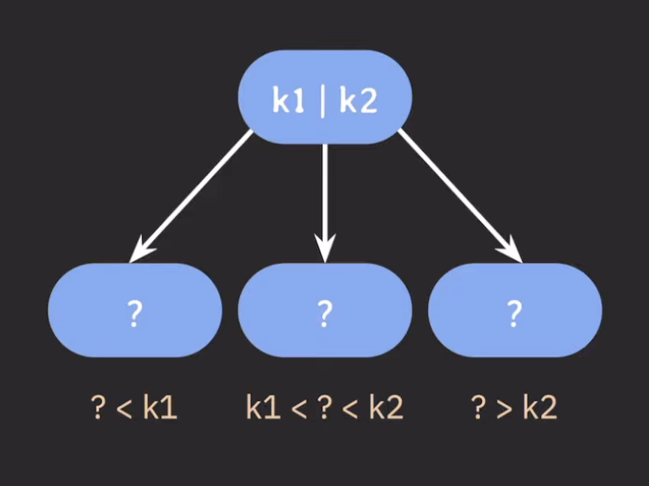

## B-tree란?
> 이진 탐색 트리(BST)를 일반화한 트리 구조

#### 이진 트리와의 차이점
- 이진 트리는 자녀 노드를 2개만 가진다.
- B-tree는 2개 이상의 자녀 노드를 가질 수 있다.

#### Key값의 개수에 따른 자녀 노드 개수
- 하나의 노드에 들어가는 Key값의 개수가 M개인 경우
	- 자녀 노드는 최대 M-1개 가질 수 있다.

#### Key값 설정 규칙 : 오름차순
- 부모 노드의 Key들은 오름차순으로 정렬한다.
- 정렬된 순서에 따라 자녀 노드들의 Key값의 범위가 결정

#### B-tree의 파라미터
- `M` : 각 노드의 최대 자녀 노드 수
	- M차 B-tree : 최대 M개의 자녀를 가지는 B-tree
- `M-1` : 각 노드의 최대 Key수
- `[M/2]` : 각 노드의 최소 자녀 노드 수
	- 소수값이 나올 경우 올림을 한다.
	- root node, leaf node 제외
- `[M/2]-1` : 각 노드의 최소 Key수
	- 마찬가지로 올림을 한다.
	- root node 제외

#### B-tree 규칙
- internal 노드의 Key수가 x개라면, 자녀 노드의 수는 언제나 x+1개
- 노드가 최소 하나의 Key는 가지기 때문에, 몇 차인지는 상관없이 internal노드는 최소 두 개의 자녀는 가지게 된다.
	- `M`이 정해지면 root 노드를 제외하고, internal노드는 최소 `[M/2]`개의 자녀 노드를 가질 수 있게 된다.

## B-tree 데이터 삽입
- 추가는 항상 leaf 노드에 한다.
- **노드가 넘치면**, 가운데(median) Key를 기준으로, 좌우 Key들은 분할하고 가운데 Key는 승진한다.

#### 노드가 넘친다?
- `M`이 2일 경우, Key는 최대 3개가 된다.
- 하나의 노드의 Key가 4개가 되면, 이것이 노드가 넘쳤다는 의미가 된다.

#### B-tree 구조의 특징
- 삽입을 아무리 계속해도, 모든 leaf 노드들은 항상 같은 레벨에 있다.
	- => **Balanced tree**
	- 검색의 시간 복잡도가 O(log N)