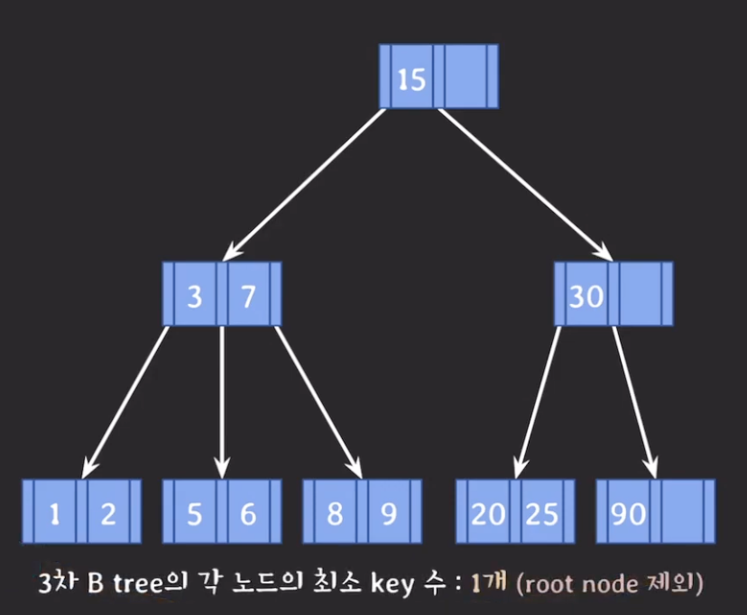

## B-tree 데이터 삭제
- 항상 leaf 노드에서 삭제 진행
- 삭제 후 최소 Key수보다 적어졌다면 **재조정**
	- 최소 Key수 = `[M/2]-1`

#### 재조정 규칙
1. Key수가 여유있는 형제의 지원을 받는다.
	- 동생에게 우선적으로 지원받는다.
2. 1번이 불가능하면, 부모의 지원을 받고 형제와 합친다.
3. 2번 후 부모에 문제가 있다면, 부모도 같은 규칙으로 재조정

#### 지원 받을 시 규칙
- 형제에게 지원받을 시, 형제의 Key값을 그대로 받으면 안된다.
- 데이터의 순서가 지켜져야 하므로, 형제와 자신 사이에 있는 부모의 Key값을 물려받고, 형제의 값을 부모에게 준다.
- 형제와 합칠 때는, 항상 동생 쪽으로(왼쪽으로)합친다.
- 부모가 root노드이고, 해당 노드가 비어있다면 재조정을 하지 않고 삭제한다.

## Internal 노드 데이터 삭제
- 항상 leaf 노드의 데이터를 삭제한다는 규칙은 지켜져야 한다.
- 따라서, 삭제할 Internal 노드의 Key값을 leaf 노드와 위치를 바꾼 후 삭제한다.

#### 어떤 leaf노드와 위치를 바꿀 것인가?
> 삭제할 데이터의 predecessor(선임자) 혹은 후임자(successor)와 위치를 바꾼다.
- `predecessor` : 나보다 작은 데이터들 중 가장 큰 데이터
	- 자신 기준, 왼쪽 서브트리 중 가장 큰 리프 노드 데이터
- `successor` : 나보다 큰 데이터들 중 가장 작은 데이터
	- 자신 기준, 오른쪽 서브 트리 중 가장 작은 데이터
- Internal 노드의 데이터 삭제 후, 같은 방법으로 재조정을 하면 된다.